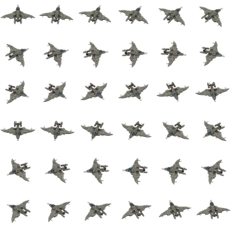
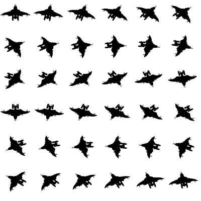

# Function register_plane (api.lua)

Informs the AircraftRealism mod that two vehicles are the grounded and airborne versions of a plane.

## Syntax

```c
void register_plane(
    [in] table config
)
```

## Parameters

`[in] config`

Lua table specifying the plane configuration, its members are described below.

---

```c
{
    string transition_speed_setting,
    string grounded_name,
    string airborne_name,
    number max_speed,
    table  shadow_sprite,
    number shadow_end_speed,
    table  shadow_offset,
    string shadow_layer,
    number shadow_alpha
}
```

`transition_speed_setting`

The name of the setting for the transition speed of the plane.

`grounded_name`

Prototype name for the grounded version of the plane.

`airborne_name`

Prototype name for the airborne version of the plane.

`max_speed`

Maximum speed of the airborne plane, cannot accelerate past this (tiles/tick)

`shadow_sprite`

Array specifying the shadow sprites for each direction of the plane, directions start from north, rotating clockwise. For more information, see [shadows](#Shadows).

`shadow_end_speed`

Speed after plane transition speed to end the shadow animation (tiles/tick)

Default: 10/216 (10 km/h)

`shadow_offset`

The shadow will move from its initial position to this at the end of the shadow animation.

Default: {50, 20}

`shadow_layer`

Where to render the shadow, One of [Renderlayer](https://lua-api.factorio.com/latest/concepts/RenderLayer.html).

Default: "smoke"

`shadow_alpha`

Shadow tint begins with this alpha and falls to 0.

Default: 0.5

## Return Value

Returns nil.

## Shadows

Animated shadows for the plane is enabled if `shadow_sprite` is defined, creating an effect of the plane's shadow becoming smaller as the plane gains speed to give the illusion of altitude.

[Animated shadow example](https://i.imgur.com/ha4xlv3.mp4)

The number of directions in the shadow must correspond to the number of directions in the entity sprite. For the example below, `shadow_sprite` will be length 36, first sprite points to the north, rotating clockwise.




The relevant Lua to generate the sprites

```lua
spriteNames = {}
for i=0,35 do
    local xPos = i % 6
    local yPos = math.floor(i / 6)

    spriteNames[i + 1] = "gunship-shadow-" .. tostring(i)
    local sprite = {
        type = "sprite",
        name = "gunship-shadow-" .. tostring(i),
        filename = "__Aircraft-space-age__/graphics/entity/gunship/gunship_spritesheet-shadow.png",

        width = 224,
        height = 224,
        x = xPos * 224,
        y = yPos * 224,
        shift = util.by_pixel(54, 35),
        scale = 1,

        hr_version = {
            filename = "__Aircraft-space-age__/graphics/entity/gunship/hr-gunship_spritesheet-shadow.png",

            width = 448,
            height = 448,
            x = xPos * 448,
            y = yPos * 448,
            shift = util.by_pixel(54, 35),
            scale = 0.5,
        }
    }
    data:extend{sprite}
end
```